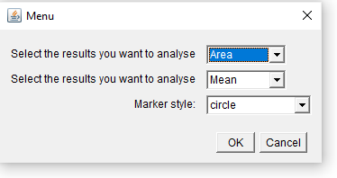
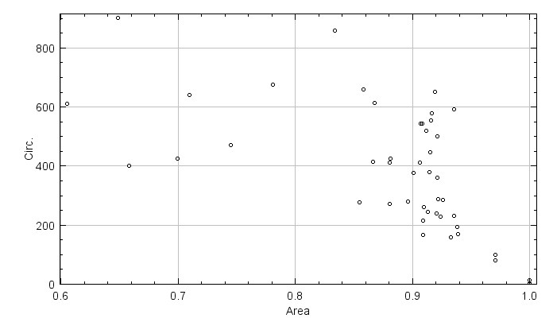

# Plot results

This macro allows the user to plot 2 results parameters found in the results table.

## Download code

Select the file "Results_Graph.ijm" and select "Raw" from the right side menu. Select all the code and copy and paste this into the text editor from ImageJ/Fiji (File > New > Text Window). Alternatively, you can download all files via the green "Code" button as a ZIP file and extract the macro file. Save this file in your macros sub-folder within the ImageJ or Fiji folder with the name Results_Graph.ijm.

## Run macro

To run the macro a single time create a results table and via Plugins > Macros > Run... select the macro. Alternatively install it via Plugins > Macros > Install ... and the macro will be added to the Plugins > Macros menu, till you restart ImageJ/Fiji.

## Disclaimer

All the macros published on this repository can be used at your own risk. Although I did my best to ensure that they run as intended, there may be bugs, not expected use or changes to the ImageJ code that results in unexpected behaviour. If you notice a problem with any of the macros please let me know and I will try to solve the problem.